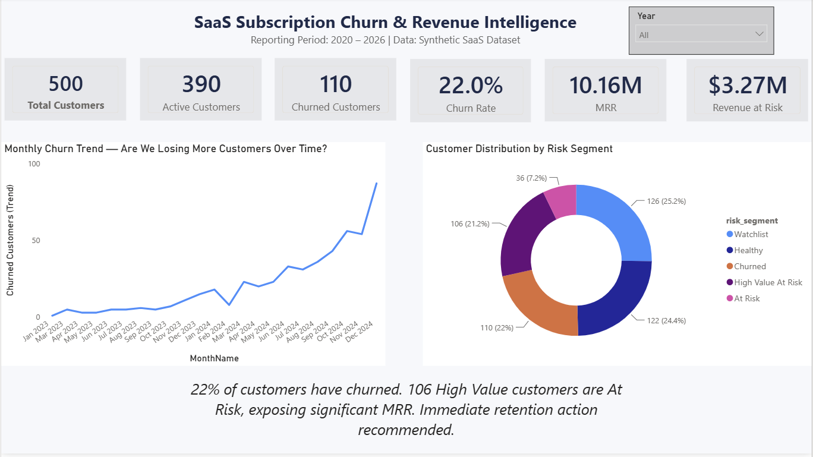
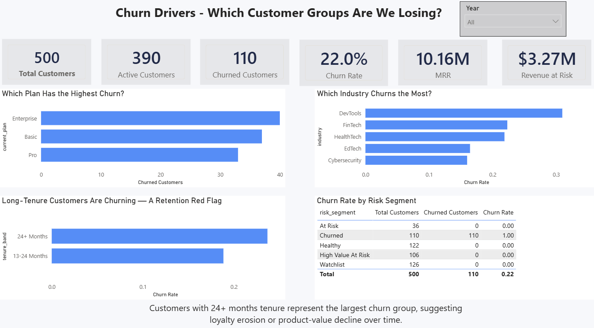
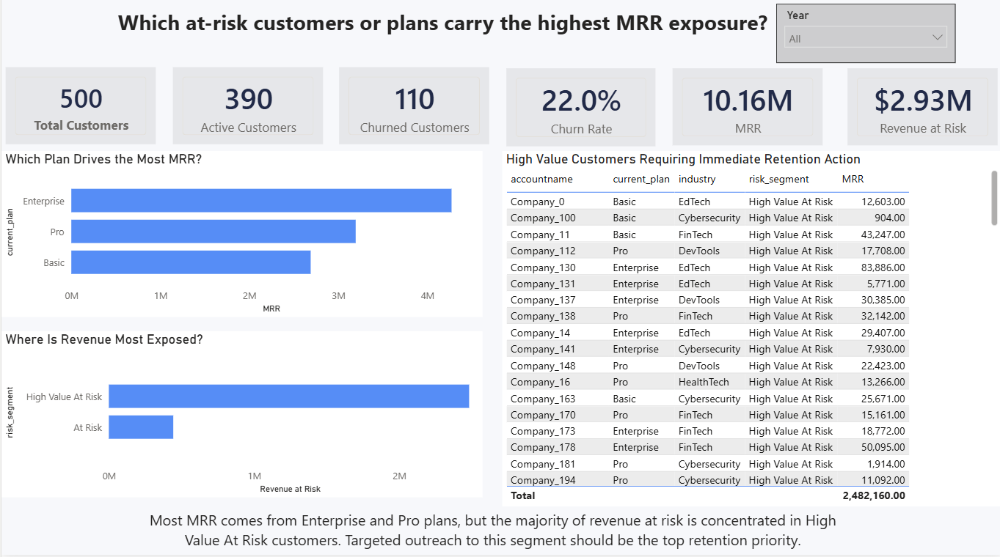

# SaaS Subscription Churn and Revenue Intelligence Dashboard

## Project Overview
An end-to-end BI analytics project analyzing subscription churn, monthly recurring revenue (MRR) risk,
customer usage patterns, and support burden for a fictional SaaS company called **RavenStack**.
Built to demonstrate SQL, Python, Power BI, and dashboard QA skills for Data Analyst / BI Analyst roles.

## Business Problem
RavenStack is experiencing customer churn that erodes monthly recurring revenue. Leadership needs to
identify which customer segments are most likely to churn, how much MRR is at risk, and what
retention actions should be prioritized. Usage is declining in specific segments, and support ticket
volume may be a leading indicator of churn.

## Core Business Questions
1. What is the overall churn rate and how has it trended month over month?
2. How much MRR is currently at risk from At Risk and High Value At Risk customers?
3. Which subscription plans (Basic, Pro, Enterprise) have the highest churn rates?
4. Which industries and tenure bands churn more than others?
5. Does higher support ticket volume correlate with higher churn likelihood?
6. Which customer segments should be prioritized for retention action first?

## Tools Used
| Tool | Purpose |
|---|---|
| MySQL | Data loading, cleaning views, KPI validation |
| Python + Jupyter | EDA, data profiling, metric validation, churn-risk segmentation |
| Power BI Desktop | Semantic model, DAX measures, 3-page executive dashboard |
| Git / GitHub | Version control and portfolio documentation |

## Dataset
**Source:** [SaaS Subscription & Churn Analytics Dataset — Kaggle](https://www.kaggle.com/datasets/rivalytics/saas-subscription-and-churn-analytics-dataset)
**Company Name in Data:** RavenStack (fictional)
**Type:** Synthetic data — not real customer data

| File | Description | Rows |
|---|---|---|
| ravenstack_accounts.csv | Customer account profiles | 500 |
| ravenstack_subscriptions.csv | Subscription records with MRR | 3,814 |
| ravenstack_support_tickets.csv | Support ticket history | 2,000 |
| ravenstack_churn_events.csv | Churn event records with reason codes | 539 |

## Dashboard Pages
| Page | Business Question | Key Visuals |
|---|---|---|
| Executive Overview | Is churn increasing and how much revenue is exposed? | KPI cards, monthly churn trend, customer health distribution (risk segment donut) |
| Churn Drivers | Which customer groups churn more often? | Churn by plan, churn by industry, churn by tenure band, risk-segment table |
| Revenue Risk | Which at-risk customers or plans carry the highest MRR exposure? | MRR by plan, revenue at risk by risk segment, high-value at-risk customer table |

## Dashboard Screenshots

### Page 1 — Executive Overview


### Page 2 — Churn Drivers


### Page 3 — Revenue Risk


## Key KPIs
| KPI | Definition |
|---|---|
| Total Customers | Distinct accounts in accounts table (500) |
| Active Customers | Accounts where churnflag indicates active status (390) |
| Churned Customers | Accounts flagged as churned in the accounts table (110) |
| Churn Rate | Churned Customers / Total Customers (22%) |
| MRR | SUM(monthly_fee) from subscriptions where active_revenue_flag = 1 (excludes trial and ended subscriptions) |
| Revenue at Risk | MRR (active_revenue_flag = 1) from customers in At Risk or High Value At Risk segments |
| Support Ticket Nulls | 41.2% of tickets have no satisfaction score (excluded from AVG calculations) |

## Key Findings
1. Churn rate stands at 22% (110 of 500 customers), a material loss rate for a SaaS business of this size.
2. Churn is accelerating — the monthly trend shows a clear upward pattern from early 2023 through late 2024.
3. Enterprise plan and DevTools industry are the highest-churn segments, with DevTools leading all industries in churn rate.
4. Long-tenure customers (24+ months) are churning more than the 13–24 month cohort, signaling possible loyalty erosion rather than early-onboarding failure.
5. Revenue risk is concentrated in a small group — the High Value At Risk segment accounts for ~$2.93M of exposed MRR, far more than the general At Risk segment.

## Recommended Actions
1. Launch a targeted retention program for High Value At Risk accounts, prioritizing outreach to the highest-MRR customers first.
2. Conduct root-cause interviews with churned Enterprise customers to identify pricing, onboarding, or support gaps.
3. Build a DevTools-specific retention playbook addressing adoption and value communication for that industry.
4. Introduce a loyalty program (renewal discounts, advanced features) targeted at customers with 24+ months tenure.
5. Embed this dashboard into recurring Customer Success reviews (monthly/QBR) to monitor churn and revenue risk continuously.

Full analysis and QA detail available in [`docs/executivesummary.md`](docs/executivesummary.md) and [`docs/qachecklist.md`](docs/qachecklist.md).

## Repository Structure
```
saas-churn-revenue-analytics/
data/raw/ ← original Kaggle CSVs (never edited)
data/processed/ ← cleaned outputs for Power BI
sql/ ← create, clean, and KPI validation scripts
notebooks/ ← Python EDA and validation notebook
powerbi/ ← .pbix dashboard file
docs/ ← data dictionary, QA checklist, executive summary
images/ ← dashboard screenshots
```


## How to Reproduce
1. Download dataset from Kaggle link above → place CSVs in `data/raw/`
2. Run SQL scripts in order:
   - `sql/01_create_tables.sql`
   - `sql/02_cleaning_views.sql`
   - `sql/03_kpi_validation.sql`
3. Open `notebooks/saas_churn_eda_quality_checks.ipynb` and run all cells
4. Open `powerbi/SaaS_Churn_Revenue_Dashboard.pbix` in Power BI Desktop

## Status
✅ Complete — Days 1–7 finished. Dashboard built, KPIs reconciled across SQL/Python/Power BI, and full documentation delivered.